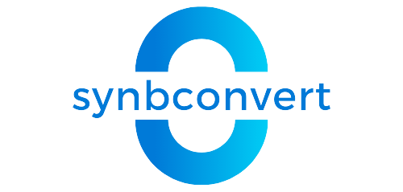
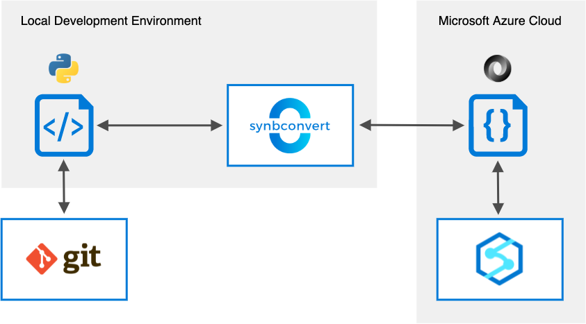

<div style="text-align:center"></div>

# synbconvert

[](https://alpine-data.github.io/synbconvert/)


Azure Synapse Analytics and Data Factory use notebooks for data preparation, data visualization, machine learning, and many other tasks. 
However, performing proper version control working with these notebooks is a pain. 
Merging long nested JSON documents with git is nearly impossible.
If you would like to use Azure Synapse Analytics or Data Factory for large scale projects while compling with the standards of good software engineering, synbconvert may be the tool you are looking for.
You will be able to develop code in your favorite IDE and colaborate with your team as usual.

## Features

synbconvert is a simple command line tool and Python API to convert Python files to Azure Synapse Analytics / Data Factory notebooks and vice versa.
The main features of the tool include:

- Lean annotation syntax for Python files
- Conversion of Python files to Azure Synapse Analytics / Data Factory notebooks based on annotations
- Conversion of Azure Synapse Analytics / Data Factory notebooks to annotated Python files

## Workflow

<div style="text-align:center"></div>

## Installation

### pip

synbconvert releases are available as source packages and binary wheels. Before you install synbconvert and its dependencies, make sure that your pip, setuptools and wheel are up to date. When using pip it is generally recommended to install packages in a virtual environment to avoid modifying system state. You can install synbconvert with:

```console
$ pip install synbconvert
```

<br>