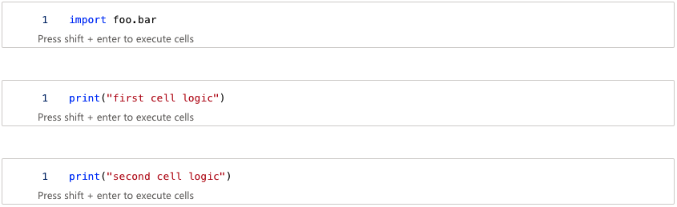
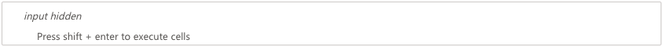
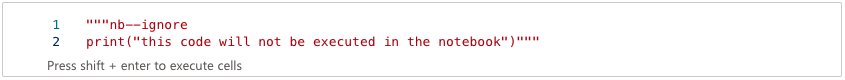
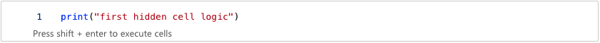
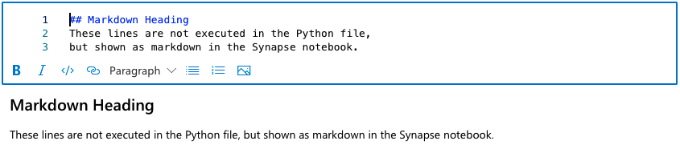
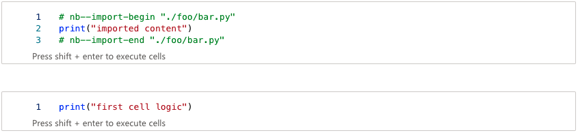

# Usage

To convert a Python file to a valid Synapse notebook, the Python file can be augmented with different markers. If no marker is used, the content of the Python file is interpreted as a single code cell.

## Defining Code Cells

Code cells are denoted by `# nb--cell` markers. All lines below the marker until the next marker are added to a code cell in the Synapse notebook. The lines above the fist marker are also added to a code cell.

```py title="example_1.py"
import foo.bar

# nb--cell
print("first cell logic")

# nb--cell
print("second cell logic")
```

The simple example above results in the following notebook:

<figure markdown>
  { width="885" }
</figure>

## Exclude Lines

To exclude lines from beeing executed in the Synapse notebook, enclose them in an opening `# nb--ignore-begin` and closing `# nb--ignore-end` marker.

```py title="example_2.py"
# nb--ignore-begin
print("this code will not be executed in the notebook")
# nb--ignore-end
```

Ignored code is added to the notebook as a hidden cell.

<figure markdown>
  { width="885" }
</figure>

After showing the cell content we notice that the code is commented out so it will not be executed. Moreover it contains a ``nb--ignore`` marker for reverse conversion.

<figure markdown>
  { width="885" }
</figure>

## Hide Cells

If you want cells to be executed but remain hidden in the notebook at the same time, use the marker `nb--hidden`.

```py title="example_3.py"
"""
import foo.bar

# nb--hidden
print("first hidden cell logic")
"""
```

A hidden cell will be added to the notebook.

<figure markdown>
  { width="885" }
</figure>

However, compared to an ignored cell, after showing the cell content we notice that the code is not commented out so it will  be executed.

<figure markdown>
  { width="885" }
</figure>

## Markdown

Markdown is not executed in the Python file but should be shown as formatted text in the Synapse notebook. To define markdown cells, use a docsting comment with a `nb--markdown` marker. 

```py title="example_3.py"
"""nb--markdown
## Markdown Heading
These lines are not executed in the Python file,
but shown as markdown in the Synapse notebook. 
"""
```

The simple example above results in the following markdown cell:

<figure markdown>
  { width="885" }
</figure>

## Include Files

By converting, the content of imported modules is included in the Synapse notebook (works only with full relative imports). When converting the notebook back to a Python file, relatively imported modules are also written.

```py title="example_4.py"
# these imports are included in the notebook
from .some_module import *
from .some_package.some_module import *
from .some_package.some_sub_package.some_module import *

# these imports are not included in the notebook
from some_module import *               # not relative
from .some_module import some_method    # not full
from .some_module import SomeClass      # not full
```

This example includes a file "example_5.py" that imports from the module "foo/bar.py".

```py title="example_5.py"
import .foo.bar

# nb--cell
print("first cell logic")
```

```py title="foo/bar.py"
print("imported content")
```

The resulting cells contain ``nb--import-begin`` and ``nb--import-end`` markers for reverse conversion.

<figure markdown>
  { width="885" }
</figure>

<br>